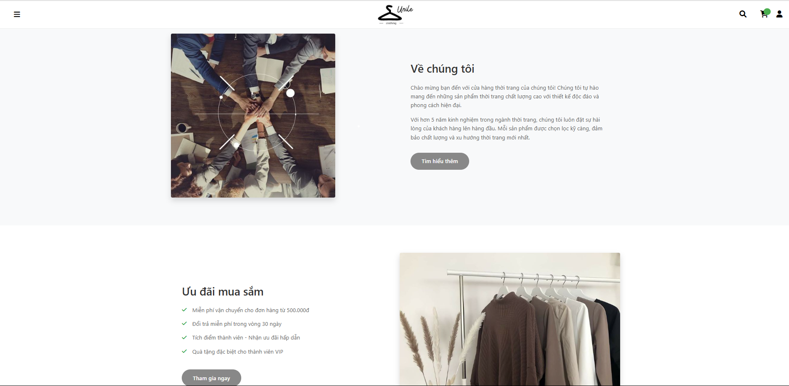
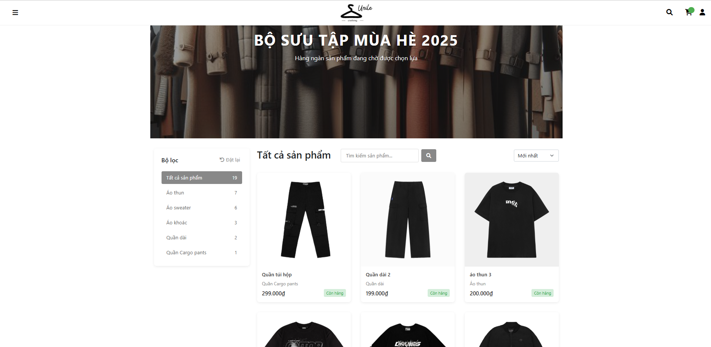
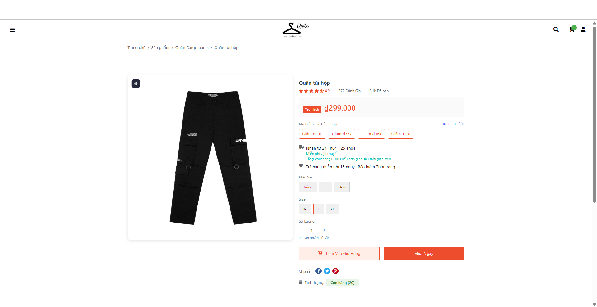
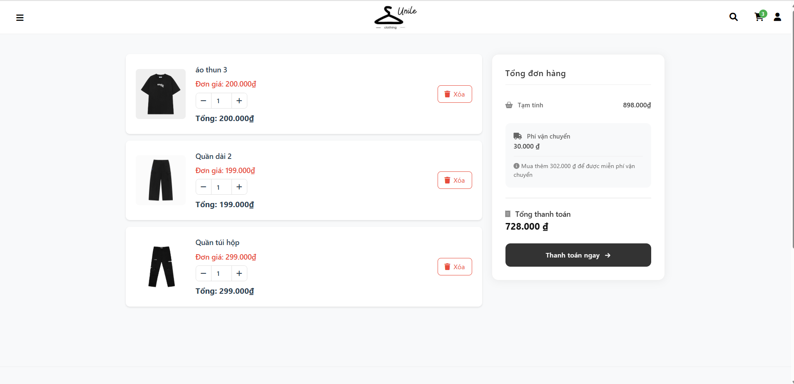
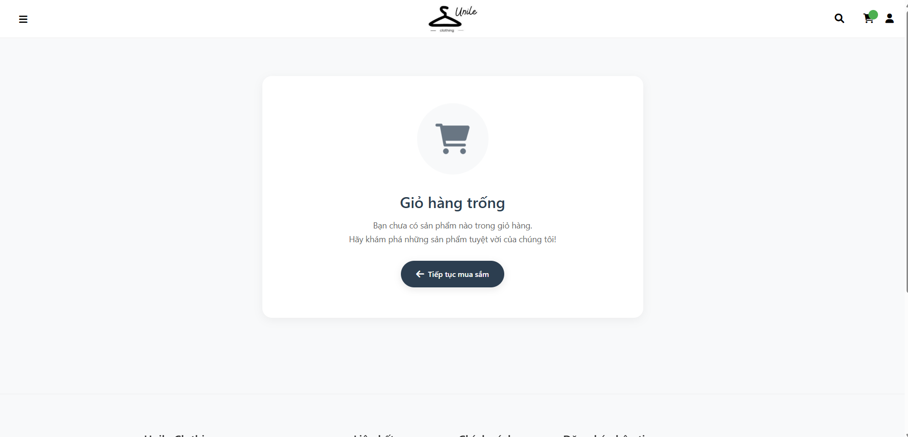
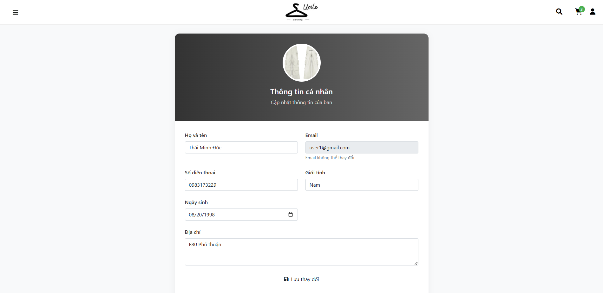
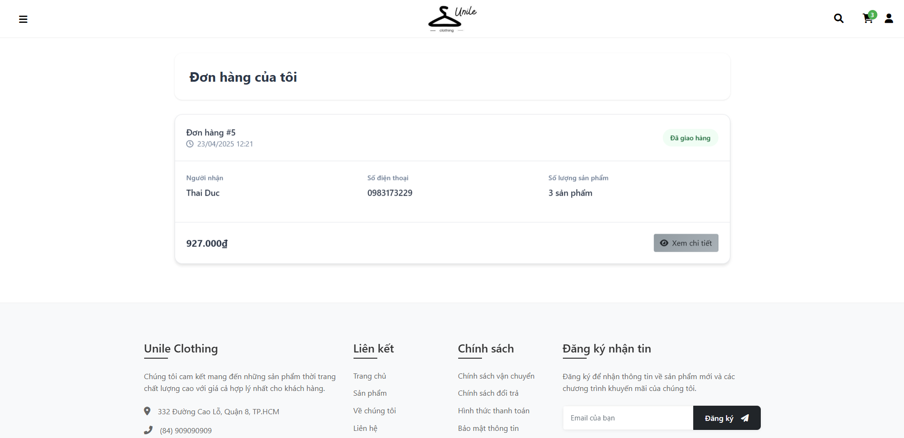

# 🚀 [Uniclothing - ECommerce website] 🚀

Một website e-commerce được xây dựng với kiến trúc MVC, cung cấp trải nghiệm mua sắm trực tuyến hiệu quả và thân thiện.

---

## 📖 Mục Lục

* [✨ Các Chức Năng Chính](#-các-chức-năng-chính)
* [📸 Screenshots / Demo Project](#screenshots)
* [⚙️ Cách Hoạt Động Của Website](#️-cách-hoạt-động-của-website)
    * [Luồng Xử Lý Chính \& Mô Hình MVC](#luồng-xử-lý-chính--mô-hình-mvc)
    * [Thứ Tự Hoạt Động Chi Tiết](#thứ-tự-hoạt-động-chi-tiết)
    * [Các Luồng Xử Lý Chính Theo Chức Năng](#các-luồng-xử-lý-chính-theo-chức-năng)
* [📁 Cấu Trúc Thư Mục và Chức Năng File](#-cấu-trúc-thư-mục-và-chức-năng-file)
    * [Controllers (`app/Controllers/`)](#controllers-appcontrollers)
    * [Models (`app/Models/`)](#models-appmodels)
    * [Views (`app/Views/`)](#views-appviews)
    * [Config (`config/`)](#config-config)
    * [Public (`public/`)](#public-public)
    * [Database (`database/`)](#database-database)


## ✨ Các Chức Năng Chính

* **👤 Quản lý người dùng:**
    * Đăng ký tài khoản mới.
    * Đăng nhập / Đăng xuất an toàn.
    * Quản lý thông tin tài khoản cá nhân (cập nhật profile, đổi mật khẩu).
* **🛍️ Quản lý sản phẩm:**
    * Xem danh sách sản phẩm (phân trang, sắp xếp).
    * Xem chi tiết thông tin từng sản phẩm.
    * Tìm kiếm sản phẩm nhanh chóng theo tên, mô tả.
    * Lọc sản phẩm theo danh mục, giá, thuộc tính khác.
* **🛒 Giỏ hàng:**
    * Thêm sản phẩm vào giỏ hàng.
    * Xem/Xóa sản phẩm khỏi giỏ hàng.
    * Cập nhật số lượng sản phẩm trong giỏ.
    * (Lưu giỏ hàng vào Session hoặc Database cho user đã đăng nhập).
* **💳 Đặt hàng:**
    * Tạo đơn hàng từ các sản phẩm trong giỏ.
    * Điền thông tin giao hàng.
    * Thực hiện quy trình thanh toán.
* **📦 Quản lý đơn hàng (Cho người dùng):**
    * Xem lịch sử các đơn hàng đã đặt.
    * Theo dõi trạng thái chi tiết của đơn hàng (ví dụ: Chờ xác nhận, Đang xử lý, Đang giao, Đã giao, Đã hủy).
* **🔍 Tìm kiếm sản phẩm:** Chức năng tìm kiếm nâng cao, gợi ý từ khóa.
* **🏷️ Phân loại sản phẩm:** Sản phẩm được tổ chức khoa học theo các danh mục đa cấp.


---

## 📸 Demo Project 

* **Trang chủ:**
    
    
     
* **Trang danh sách sản phẩm:**
    
* **Trang chi tiết sản phẩm:**
    
* **Giỏ hàng:**
    
    
* **Trang thanh toán:**
    
* **Trang quản lý tài khoản:**
    
* **Trang quản lý đơn hàng:**
    

--- 

## ⚙️ Cách Hoạt Động Của Website

### Luồng Xử Lý Chính & Mô Hình MVC

Dự án áp dụng kiến trúc **Model-View-Controller (MVC)** để phân tách các thành phần:

* **Model:** Quản lý dữ liệu và logic nghiệp vụ liên quan đến dữ liệu (tương tác với database).
* **View:** Hiển thị giao diện người dùng (HTML, CSS, JS).
* **Controller:** Trung gian nhận request, điều phối xử lý, gọi Model và chọn View.

**Sơ đồ luồng xử lý cơ bản:**

[👤 User Request (Browser)]
          |
          V
[🌐 Router / index.php] -- Route Request --> [🎮 Controller]
                                                /|\      |
                                                 |       | Request Data/Logic
                                Return Data      |       V
                                                 |      [🧱 Model (DB Interaction)]
                                                 |       |
          Pass Data                              |      /
                 <-------------------------------       /
                 |
                 V
        [🖼️ View (HTML Template)]
                 |
                 | Generate HTML
                 V
        [💻 User Response (Browser)]

1.  **[👤 User Request (Browser)]**: Người dùng gửi yêu cầu từ trình duyệt.
2.  **[🌐 Router / index.php]**: Yêu cầu được chuyển đến bộ định tuyến (Router) hoặc file đầu vào (index.php).
3.  **[🎮 Controller]**: Router xác định và chuyển yêu cầu đến Controller phù hợp.
4.  **[🧱 Model (DB Interaction)]**: Controller tương tác với Model để yêu cầu dữ liệu hoặc thực thi logic nghiệp vụ (ví dụ: truy vấn cơ sở dữ liệu).
5.  **[🎮 Controller]**: Model trả dữ liệu về cho Controller.
6.  **[🖼️ View (HTML Template)]**: Controller chuyển dữ liệu đã xử lý sang View (template HTML).
7.  **[💻 User Response (Browser)]**: View tạo ra nội dung HTML hoàn chỉnh và gửi về trình duyệt cho người dùng.

## 📁 Cấu Trúc Thư Mục và Chức Năng File

Dự án được tổ chức theo cấu trúc thư mục rõ ràng, tuân thủ mô hình MVC để đảm bảo tính module hóa và dễ bảo trì:

```plaintext
.
├── 📂 app/                     # ✨ Lõi ứng dụng (Source Code)
│   ├── 🎮 Controllers/         #   » Xử lý request, điều phối logic nghiệp vụ
│   │   ├── BaseController.php    #     • Controller cơ sở, chứa các phương thức dùng chung.
│   │   ├── AuthController.php      #     • Quản lý: Đăng nhập, Đăng ký, Quản lý tài khoản.
│   │   ├── ProductController.php   #     • Quản lý: Hiển thị, Tìm kiếm, Lọc sản phẩm.
│   │   ├── CartController.php      #     • Quản lý: Thao tác Giỏ hàng (Thêm, Xóa, Cập nhật).
│   │   ├── OrderController.php     #     • Quản lý: Đặt hàng, Lịch sử/Trạng thái đơn hàng.
│   │   ├── HomeController.php      #     • Quản lý: Trang chủ và các trang tĩnh.
│   │   └── AjaxController.php      #     • (Tùy chọn) Xử lý các yêu cầu AJAX.
│   │
│   ├── 🧱 Models/              #   » Tương tác với Database, chứa logic dữ liệu
│   │   ├── BaseModel.php         #     • Model cơ sở: Kết nối CSDL, phương thức CRUD cơ bản.
│   │   ├── User.php              #     • Model cho bảng `users`.
│   │   ├── Product.php           #     • Model cho bảng `products`.
│   │   ├── ProductModel.php      #     • (Tùy chọn) Logic phức tạp hơn cho Sản phẩm.
│   │   ├── CartModel.php         #     • Xử lý logic Giỏ hàng (thường không phải bảng DB).
│   │   ├── OrderModel.php        #     • Model cho bảng `orders`, `order_details`.
│   │   └── Category.php          #     • Model cho bảng `categories`.
│   │
│   └── 🖼️ Views/               #   » Hiển thị giao diện người dùng (HTML Templates)
│       ├── layouts/              #     • Bố cục chính của trang (header, footer, sidebar...).
│       ├── templates/            #     • Các template dùng chung (ít dùng hơn partials).
│       ├── partials/             #     • Các thành phần view nhỏ, tái sử dụng (VD: product_card).
│       ├── home/                 #     • Views cho Trang chủ.
│       ├── products/             #     • Views cho Sản phẩm (danh sách, chi tiết...).
│       ├── cart/                 #     • Views cho Giỏ hàng.
│       ├── orders/               #     • Views cho Đơn hàng (lịch sử, chi tiết...).
│       ├── auth/                 #     • Views cho Đăng nhập / Đăng ký.
│       ├── account/              #     • Views cho Quản lý tài khoản.
│       └── error/                #     • Views cho các trang lỗi (404, 500...).
│
├── ⚙️ config/                  # ✨ Chứa các file cấu hình ứng dụng
│   ├── database.php            #   • Cấu hình kết nối Cơ sở dữ liệu.
│   ├── routes.php              #   • Định nghĩa Routes (ánh xạ URL -> Controller).
│   └── app.php                 #   • Các cấu hình chung khác (timezone, keys...).
│
├── 🌐 public/                  # ✨ Thư mục gốc web server (Document Root)
│   ├── 🎨 css/                 #   • Chứa các file CSS (Stylesheet).
│   ├── 📜 js/                  #   • Chứa các file JavaScript.
│   ├── 🏞️ images/              #   • Chứa các file hình ảnh, media.
│   └── index.php               #   • 🔥 Entry Point - Điểm vào duy nhất của ứng dụng.
│
├── 🗃️ database/                # ✨ Quản lý Cơ sở dữ liệu
│
└── 📄 README.md                # ✨ File tài liệu hướng dẫn này.